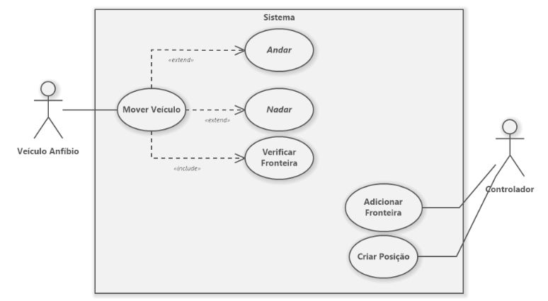
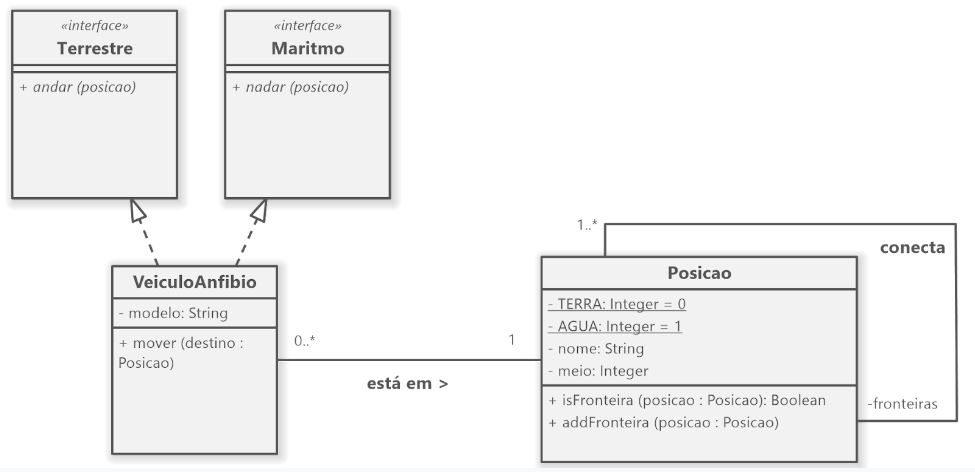
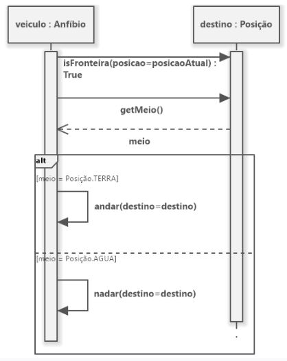

1. Considerando os diagramas na página seguinte, implemente o sistema descrito em Python. (3,0)

2. Em Python, com base no código criado na questão anterior, instancie três Posições (2,0): 

- Afogados da Ingazeira, existe no meio TERRA, conectada ao Rio Pajeú;

- Serra Talhada, existe no meio TERRA, conectada ao Rio Pajeú;

- Rio Pajeú, existe no meio AGUA, conectado à Afogados da Ingazeira e Serra Talhada.

E instancie o seguinte veículo:

- Modelo Cyclomer, que se encontra em Afogados da Ingazeira.

3. Suponha que queremos mover o veículo Cyclomer de sua posição inicial ao Rio Pajeú e, do Rio Pajeú à Serra Talhada. Explique os métodos e atributos acessados durante cada passo do processo. (3,0)

4. Altere o diagrama de classes para incluir um padrão de projeto (entre os vistos durante a disciplina). (2,0)

