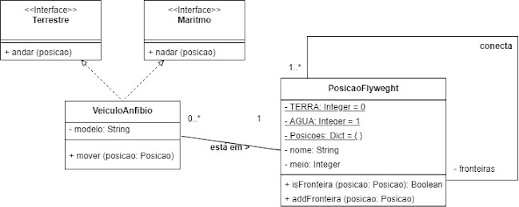

1. Considerando os diagramas na página seguinte, implemente o sistema descrito em Python. (3,0)

2. Em Python, com base no código criado na questão anterior, instancie três Posições (2,0): 

- Afogados da Ingazeira, existe no meio TERRA, conectada ao Rio Pajeú;

- Serra Talhada, existe no meio TERRA, conectada ao Rio Pajeú;

- Rio Pajeú, existe no meio AGUA, conectado à Afogados da Ingazeira e Serra Talhada.

E instancie o seguinte veículo:

- Modelo Cyclomer, que se encontra em Afogados da Ingazeira.

3. Suponha que queremos mover o veículo Cyclomer de sua posição inicial ao Rio Pajeú e, do Rio Pajeú à Serra Talhada. Explique os métodos e atributos acessados durante cada passo do processo. (3,0)

4. Altere o diagrama de classes para incluir um padrão de projeto (entre os vistos durante a disciplina). (2,0)


```python
# Questão 01

from abc import abstractmethod, ABC

class Terrestre(ABC):

    @abstractmethod
    def andar(self,posicao):
        pass


class Maritmo(ABC):

    @abstractmethod
    def nadar(self,posicao):
        pass


class VeiculoAnfibio(Maritmo,Terrestre):
    def __init__(self,modelo,posicao):
        self.modelo = modelo
        self.posicao = posicao

        self.posicao.vAnfibio.append(self)

    def verificarFronteira(self,posicao):
        return self.posicao.isFronteira(posicao)

    def nadar(self, posicao):
        self.posicao.vAnfibio.remove(self)
        self.posicao = posicao
        posicao.vAnfibio.append(self)

    def andar(self, posicao):
        self.posicao.vAnfibio.remove(self)
        self.posicao = posicao
        posicao.vAnfibio.append(self)

    def mover(self,posicao):
        if self.verificarFronteira(posicao):
            meio = posicao.getMeio()

            if meio == PosicaoFlyweght.Terra:
                self.nadar(posicao)

            if meio == PosicaoFlyweght.Agua:
                self.andar(posicao)


    def debug(self):
        print(self.modelo)
        print(self.posicao.nome)
        print("\n")

class PosicaoFlyweght:

    Terra = 0
    Agua = 1

    #Flyweght -------------------
    Posicoes = {}

    def __new__(cls,nome,meio):
        try:
            id = cls.Posicoes[nome]
        except KeyError:
            id = object.__new__(cls)
            cls.Posicoes[nome] = id
        return id

    # ----------------------------

    def __init__(self,nome,meio):
        self.nome = nome
        self.meio = meio
        self.vAnfibio = []
        self.Fron_Posicoes = []

    def getMeio(self):
        return self.meio

    def isFronteira(self,posicao):
        exist_count = self.Fron_Posicoes.count(posicao)

        if exist_count > 0:
            return True
        else:
            return False

    def addFronteira(self,posicao):
        self.Fron_Posicoes.append(posicao)

    def debug(self):
        print(PosicaoFlyweght.Posicoes)
        print(self.nome)
        print(self.meio)
        print(self.vAnfibio)
        print(self.Fron_Posicoes)
        print("\n")

# Questão 02

#Posicao
af = PosicaoFlyweght("Afogados da Ingazeira",PosicaoFlyweght.Terra)
st = PosicaoFlyweght("Serra Talhada",PosicaoFlyweght.Terra)
rp = PosicaoFlyweght("Rio Pajeú",PosicaoFlyweght.Agua)


af.addFronteira(rp)

st.addFronteira(rp)

rp.addFronteira(af)
rp.addFronteira(st)

af.debug()
st.debug()
rp.debug()

#Veiculo;
v = VeiculoAnfibio("Cyclomer",af)

v.debug()

# Questão 03

v.mover(rp)
# Primeiro ele vai verificar se a posição destino é fronteira de sua posição atual
# Depois ele vai verificar o tipo de meio da posição destino
# Caso o meio da Posição destino for Agua ele vai usar o método nadar implementado da Interface Terrestre
# Caso o meio da Posição destino for Terra ele vai usar o método andar implementado da Interface Maritmo
# Para ambos os casos a sua posição atual se torna a posição destino.
# E posição destino recebe a referencia do veículo e a posição antiga perde a referencia do veículo.

rp.debug()
v.debug()

v.mover(st)
st.debug()
v.debug()


# Questão 04
# Uso de Flyweight na Classe Posicao

ex2 = PosicaoFlyweght("Rio Pajeú",PosicaoFlyweght.Terra) #Irá reapoveitar o Objeto Rio Pajeú ao invéz de criar um objeto novo com o mesmo Nome
ex2.addFronteira(st)
ex2.debug()

ex3 = PosicaoFlyweght("Triunfo",PosicaoFlyweght.Terra) #Irá criar um novo Objeto por que não tem outro objeto com mesma ID
ex3.debug()

```


