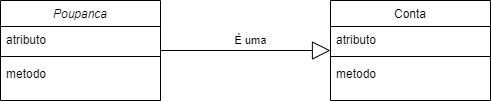
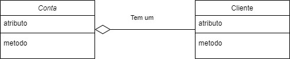
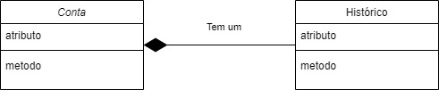

## Visibilidade

### Público, protegido e privado

OOP tem como um de seus conceitos principais o encapsulamento. A ideia de agrupar dados e métodos e **esconder** representações internas.

### Encapsulamento

- Isso inclui esconder tanto atributos quanto métodos em escopos em que não precisam ser acessados.

- Para algumas linguagens (Java, PHP, etc.) o programador deve ser considerado um risco.

- Surgem então, as visibilidades para definirmos em que escopos atributos e propriedades serão acessadas.

- Visibilidade em OO não é usado para proteger o programa, ela é usado apenas para garantir a proteção do código para os programadores que estão trabalhando entre si. Para proteger o código existem outras técnicas. 

#### Publico

Meus alunos sabem que eu moro na praia, se estivermos em um dia quente, eles sabem que podem bater na minha porta e eu oferecerei um refrigerante. Eu não moro em um condomínio fechado, logo qualquer um pode aparecer, minha porta é **pública**.
Stephen Gilbert

- Atributos e métodos públicos podem ser acessados em qualquer lugar.

- Em Python, a filosofia é um pouco diferente, programadores são considerados adultos responsáveis. 

- Portanto, em Python, todos os atributos e métodos são públicos.

- Em linguagens de visibilidade explícita, utilizamos a palavra chave public.

#### Protegido

Os alunos, no entanto, não podem simplesmente entrar e pegar um refrigerante na minha geladeira, ela não é **pública**.
Mas meus netos, que moram perto, não ligam para entrar e pegar o que quiserem na cozinha, na nossa **casa (pacote)**, minha geladeira é **protegida**.
Stephen Gilbert

- Atributos e métodos **protegidos** só podem ser acessados/modificados por membros do mesmo projeto.

- Em Python, utilizamos ‘_’ como convenção para definir atributos “protegidos”, a ideia é apenas evitar acessos/re-escritas não-intencionais.

- Em linguagens explícitas, definimos com protected.

### Privado

Mas nem tudo na nossa família é protegido, meus netos sabem que não podem mexer na minha carteira, pegar meu cartão e comprar o que quiserem na Amazon, isso não é permitido.
Minha carteira é **privada**, para acessar eles precisam realizar uma requisição.
Stephen Gilbert

- Atributos e métodos **privados** só podem ser acessados/modificados dentro do escopo do objeto que o contém.

- Em Python, name mangling (‘__’) é utilizado por convenção para criar atributos “privados”, name mangling é popularmente **odiado** por ser obscuro.

- Em linguagens explícitas, definimos com private.

### Visibilidade - Exemplo

```python
class Point:
    def __init__(self,x,y):
        self.x = x
        self.y = y

class Rectangle:
    def __init__(self):
        self.p1 = Point(0,0)
        self.p2 = Point(0,0)
        self.area = 0
```

```python
class Point:
    x = 0
    y = 0

class Rectangle:
    def __init__(self):
        self.p1 = Point()
        self.p1.x = 10
        self.p1.y = 10
        self.p2 = Point()
        self.p2.x = 10
        self.p2.y = 10
        self.area = 0
```

- De maneira geral, devemos nos questionar, quem deve ser responsável por alterar os atributos **x** e **y** de Point?

```python
class Point:
    def __init__(self,x,y):
        self.x = x
        self.y = y

class Rectangle:
    def __init__(self):
        self.p1 = Point(0,0)
        self.p2 = Point(0,0)
        self.area = abs(self.p1.x - self.p2.x) * abs(self.p1.y - self.p2.y)

r = Rectangle()
r.area = 3.14
```

- A área ainda está correta?

- Quem deveria ser responsável por impedir isso?

## Estático

atributos e métodos

### Atributo Estáticos

Tal como podemos definir atributos dentro do **__init__** que serão inicializados quando um objeto for criado, também podemos definir atributos da própria classe, já inicializados

```python
class Person:
    TITLES=('Dr','Mr','Mrs','Ms')
```

- Esses são acessados da mesma forma: person.TITLES

- Todos os objetos da classe terão atributos de classe com o mesmo valor após a criação.

- Atributos de classe podem também ser acessados pela classe, sem necessidade de instanciamento!
    
    - Person.TITLES

- Atributos de classe são comumente utilizados para definir constantes da classe.

- É importante ter cuidado! 
    - Caso o atributo de classe seja de um tipo mutável, todos os objetos da classe serão afetados: person.TITLES.append('Sr')

Mostrar **lp-exemplo-atributo-de-classe-problema.py**


Tal como atributos, **métodos** também podem ser estáticos. Em Python, definimos métodos estáticos com o decorador **@staticmethod**. Esses métodos são chamados diretamente pela classe, não necessitando de objetos.
É importante lembrar que apenas atributos estáticos poderão ser acessados.

```python
class Person:
    	TITLES = [“Mr.”, “Mrs.”]
@staticmethod
def show_titles():
	print(Person.TITLES)
```

Métodos estáticos são usados onde precisamos de computação sem necessidade de estado, é útil em funcionalidades de depuração, logging, testes, etc.

```python
class Person:
    	CREATED_PERSONS = 0
	
@staticmethod
def count_person():
	print(f”There are {Person.CREATED_PERSONS} people created.”)
```
Ex2:
```python

@staticmethold
def printar()
	pass

```
obs: Em métodos estáticos não usa self como parâmetro


obs: (atributos estáticos) Se você redefinir o valor o atributo se torna atributo de instãncia (deixa de ser estático)(para mudar o valor de atributo estático em python tem que usar append)

## Main em Python

```python

def main():
    print("Hello World!")

if __name__ == "__main__":
    main()
```

isso evita que em uma importação use o main da classe


# Relacionamentos UML

– **Herança:** significa que A é um B

Por exemplo: Poupanca é uma Conta

– **Agregação:** significa que A tem um B

Num sentido mais fraco que na composição.
Por exemplo, Conta tem um Cliente

– **Composição:** significa que A tem um B

Num sentido mais forte que na agregação.
Por exemplo, Conta tem um Historico

### Herança na UML

Representamos o relacionamento de **herança** atravésde uma seta com um triângulo vazado.



```python
class Conta:
	def __init__(self):
		self.cliente = “ ”
		self.numero = 0
	
class Poupanca(Conta):
	def __init__(self):
		Conta.__init__(self)
		self.variacao = 1
```

### Agregação na UML

Representamos o relacionamento de **agregação** através de uma seta com um losango vazado.



```python 
class Cliente:
	def __init__(self):
		self.nome = “ “
		self.cpf = “ ”

class Conta:
	def __init__(self, cli):
		self.cliente = cli
		self.numero = 0
		
fulano = Cliente( )
contaDoFulano = Conta( fulano )

```

### Composição na UML

Representamos o relacionamento de **composição** através de uma seta com um losango preenchido.



```python
class Historico:
	def __init__(self):
		self.data_abertura = “ ”
		self.transacoes = [ ]
		
class Conta:
	def __init__(self):
		self.cliente = “ ”
		self.historico = Historico( )
```
