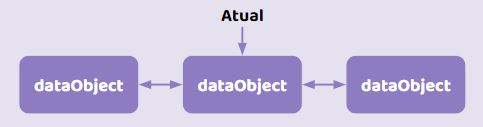
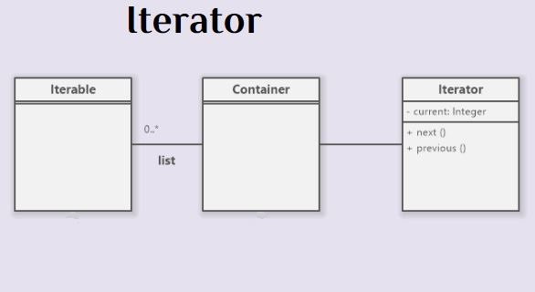
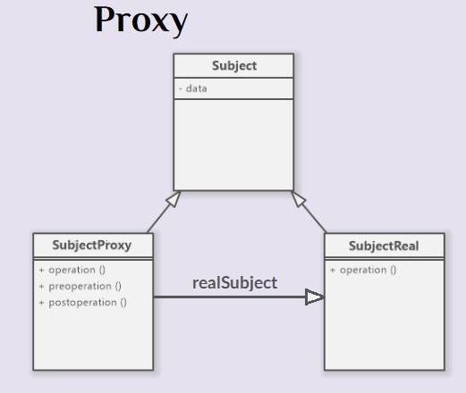

# Iterator

O padrão **Iterator** nos permite percorrer containeres de dados sem preocupação com a estrutura dos mesmos (lista, pilha, árvore, etc.).






### Pontos positivos

- permite a você percorrer elementos de uma coleção sem expor as representações dele (lista, pilha, árvore, etc.)

- Caso você insira novos dados na lista, o Interator evita precisar sempre modificar os valores do tamanho da lista em um loop quando você percorre a lista 

- Todos os iteradores devem implementar a mesma intezzzrface. Isso faz que o código cliente seja compatível com qualquer tipo de coleção ou qualquer algoritmo de travessia desde que haja um iterador apropriado. Se você precisar de uma maneira especial para a travessia de uma coleção, você só precisa criar uma nova classe iterador, sem ter que mudar a coleção ou o cliente.

```python
class Iterable(object):
    pass #Qualquer dado aqui (nesse caso trata-se de uma lista)


class Container(object):
    def __init__(self):
        self.data = list()
    
    def __iter__(self):
        return Iterator(self)
    
    def get_ith(self,i):
        if len(self.data) > i:
            return self.data[i]
        return None


class Iterator(object):
    def __init__(self,container):
        self.container = container
        self.current = 0

    def __next__(self):
        value = self.container.get_ith(self.current)
        if value is None:
            raise StopIteration
        self.current+=1
        return value

```

# Proxy

O padrão Proxy permite a criação de uma estação de acesso ou um placeholder para controlar o acesso de um outro objeto.

Nós dividiremos nossos objetos em Proxy e Real(o objeto final que você quer usar), o objeto Proxy será acessado e carregará o que precisarmos do objeto real **apenas quando necessário**. (pode escolher como e quando repassar chamadas de métodos para o objeto real).

O Proxy pode executar ações antes e depois das chamadas dos métodos do objeto real.

O Proxy é algo que fica no meio do caminho.


### Proxies podem ser usadas como:

- Proteção: controlando acesso e permitindo visibilidade apenas de atributos e métodos que são necessários para o cliente;

- Referências: permitindo acessos sofisticados, como contagem de referências a determinado objeto;

- Velocidade: atrasando a criação e inicialização de objetos caros, criando sob demanda.(lazy instantiation e lazy evaluation)

- logs, cache, distribuição de serviços... (faz com que o objeto real fique enchuto dessas coisas e só ter a regra de negócio mesmo)

### Pontos Positivos

- O código cliente nem precisa saber se está ou não usando um Proxy (ele finge ser o objeto real)

- Você pode adicionar novos Proxies sem mudar código já testado (OCP)

- O Proxy funciona mesmo se o objeto real não estiver operacional ou proto para uso

- Você pode controlar o ciclo de vida de objetos reais dentro do proxy

### Pontos Negativos

- Introduz mais classes ao sistema isso o torna mais complexo



O objeto Proxy tem tudo o que o objeto real tem (ele pode se passar do objeto real). A direfença é que o Proxy tem uma referencia ao objeto real. O objeto Proxy pode executar qualquer tarefa antes ou depois da chamada mas em algum momento ele vai chamar o Objeto real. (No caso de cache ele nem precisa chamar a referencia do objeto real caso já tenha os dados que ele que no Proxy)

```python

class Subject(object):
    def __init__(self):
        pass #Qualquer dado aqui

class RealSubject(Subject):
    def operation(self):
        pass

class ProxySubject(Subject):
    def __init__(self,*args,**Kwargs):
        self.real = None

    def operation(self):
        if self.real is None:
            self.real = RealSubect()
        self.pre_operation()
        self.real.operation()
        self.post_operation()

    def pre_operation(self):
        pass

    def post_operation(self):
        pass
```

Obs: Proxy tem algumas variações (proxy virtual, proxy remoto, proxy de proteção, proxy inteligente...)(não muda nada na estrutura mas só na sua inteção).

- Virtual: Controla acesso a recursos que podem ser caros para criação ou utilização

- Remoto: Controla acesso a recursos que estão em serviços remoto. (fora da base de código)

- Proteção: Controla acesso a recursos que possam necessitar autenticação ou permissão

- Inteligente: Além de controlar acesso ao objeto real, também executa tarefas adicionais para saber quando e como executar determinadas ações.

# Memento

O padrão de projeto memento permite que o estado anterior, ou parte do estado, de um objeto seja mantido, sem necessidade de revelar os detalhes de implementação.

- Permite forma de realizar backups e restaurações de objetos.


```python

class Memento(object):
    def __init__(self,data):
        self.data = data #Qualquer dado aqui

class Originador(object):
    def __init__(self,data):
        self.data = data #Qualquer dado aqui

    def save(self):
        return Memento(self.data)
    def undo(self,memento):
        self.data = memento.data

class Caretaker(object):
    def __init__(self,originator):
        self.mementos = list()
        self.originator = originator
    
    def save(self):
        self.mementos.append(self.originator.save())
    
    def undo(self):
        if not len(self.mementos):
            return None
        memento = self.mementos.pop()
        self.originator.undo(self,memento)

```