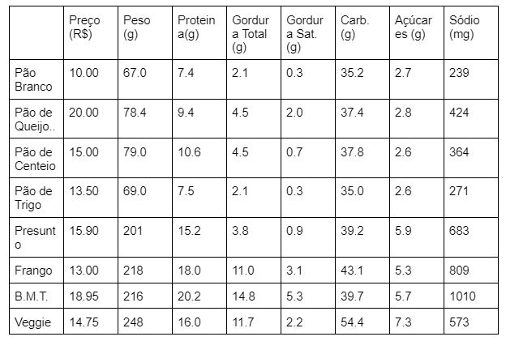

Exercise - Sub-shop

Uma loja de sanduíches permite que o cliente, ao pedir um **Sanduíche**, escolha entre 4 opções de pães: Pão Branco, Pão de Queijo e Ervas Italianas, Pão de Centeio, Pão de Trigo. Após isso, um objeto de um tipo de **Proteina** animal é adicionado ao sanduíche, novamente com uma escolha entre quatro opções: Presunto, Frango, B.M.T., Veggie. 

**Sanduíche** e **Proteína** ambos herdam de **OpçãoAlimento**, que define atributos de classe abstratos sobre o valor nutricional: preco (R$), peso (g), proteina (g), gordura_total (g), gordura_saturada (g), carboidratos (g), acucares (g), e sodio (mg). Cada opção (subclasses de abstração e de implementação de **Sanduíche** e **Proteina**) define seus valores conforme tabela abaixo:

