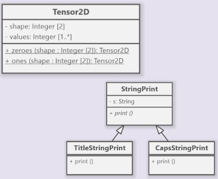
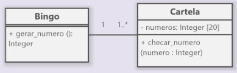
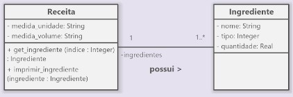
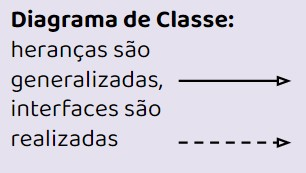
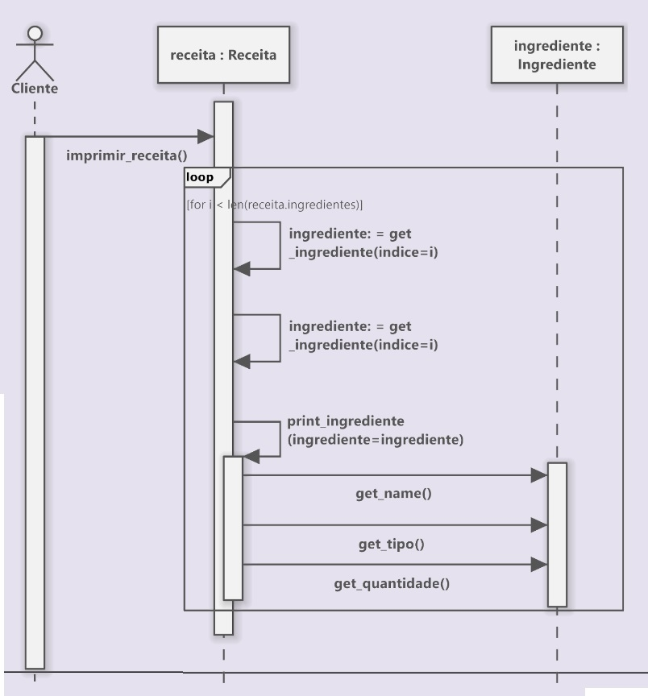
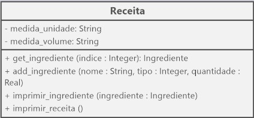

# Revisão

Lembre-se:

**Diagrama de Classe**

manter-se atento a 

sublinhados - Quer dizer que o atributo ou o método é estático

itálicos - Quer dizer que o atributo ou o método é abstrato

**Diagrama de Classe**

lembrar que associações informam atributos que podem não estar presentes em uma classe.

**Diagrama de Sequência**

Demonstra sequência temporal de chamadas de funções para realização de um cenário

