# Modelo de Classes

Em posse da visão de caso de uso do sistema, os desenvolvedores devem prosseguir no desenvolvimento

Atores:

Externamente ao sistema, os atores visualizam resultados. Cálculos, gráficos, relatórios, etc.

Objetos: 

Internamente, objetos colaboram entre si para produzir os resultados visíveis de fora.
Colaboração pode ser vista sob aspecto dinâmico ou sob aspecto estrutural estático.

## Objetivos

- Descrever método para identificação das classes de objetos de um sistema a partir dos casos de uso;

- Apresentar alguns dos elementos do diagrama de classes;

- Descrever a construção do modelo de domínio;

- Descrever a inserção do modelo de classes no desenvolvimento.

É importante notar que a modelagem de classes é um processo evolutivo.
Existem três níveis:
- Modelo de classes de domínio
- Modelo de classes de especificação
- Modelo de classes de implementação.

### Padrão de Nomeclatura:

- Espaço e preposições são removidos

- Nomes de classes e relacionamentos são escritos com iniciais maiúsculas

ex: Cliente, ItemPedido, OrdemServiço.

- Atributos e operações possuem primeira letra minúscula e junções iniciadas por letra maíuscula, ex: idade, numeroPedidos, obterTotal.

- OU junções substituídas por '_' Ex: numero_pedidos, obter_total.

## Diagrama de Classes

### Classes

Classes são uma representação abstrata de um conjunto de objetos que compartilham atributos e operações. No Diagrama de Classes, uma classe é representada como uma caixa que possui no máximo 3 compartimentos:

- Um compartimento com o nome da classe;
- Um compartimento com os atributos da classe;
- Um compartimento com as operações da classe.

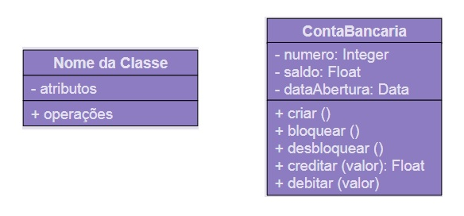

Atributos: representam a descrição dos dados armazenados pelos objetos de uma classe. Podem incluir possíveis valores (tipagem).

- idade: Integer

Operações: correspondem às ações que os objetos de uma classe sabem realizar. Operações são as mesmas para todos os objetos de uma classe. Podem incluir possíveis valores de retorno (tipagem).

- somar (valor1, valor2): Float

### Relacionamentos

Para representar que objetos/instâncias podem se relacionar durante a execução do sistema, utilizamos a associação.

- No diagrama, utilizamos uma linha reta entre classes para mostrar associações.

Exemplos:

Vendas: um cliente compra produtos

Bancário: uma conta-corrente possui um histórico de transações.

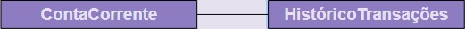

Associações são entre classes, mas representam ligações possíveis entre objetos.

Associações podem também informar os limites inferiores e superiores de quantidade de objetos. Em UML, chamamos de Multiplicidade. Os valores são mostrados em cada extremo da linha de associação.

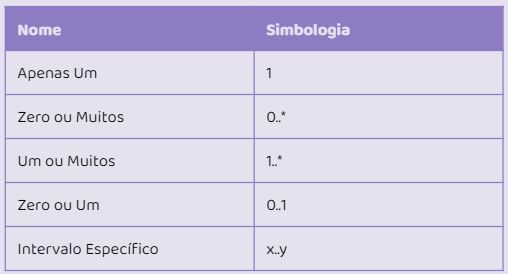

Exemplos de Multiplicidade:

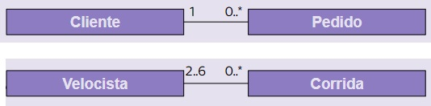

Associações podem ser separadas em três grandes grupo: “um para um”, “um para muitos”, e “muitos para muitos”. Esses grupos refletem a Conectividade das classes.

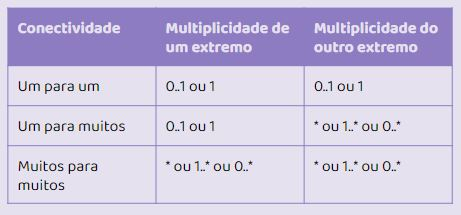

Exemplos:

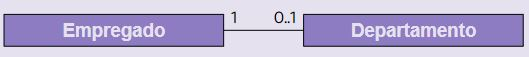

Um empregado pode gerenciar 0 ou 1 departamento, um departamento pode ser gerenciado por 1 empregado.

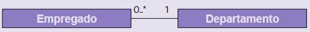

Um empregado pode atua em 1 departamento, um departamento possui 0 ou mais empregados.

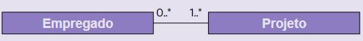

Um empregado está associado a 1 ou mais projetos, Um projeto possui 0 ou mais empregados.

Participação:

Obrigatória, caso multiplicidade mínima seja 1.

Opcional, caso multiplicidade mínima seja 0.

Recurso da Associação: características do diagrama para facilitar entendimento da relação.

Nome da Associação é escrita na linha, ao meio do caminho entre as duas classes.

Direção de Leitura, representada por um pequeno triângulo em um dos lados do nome de associação.

Papéis são posicionados em cada extremo da linha de associação, indicando o papel de cada classe nesta.

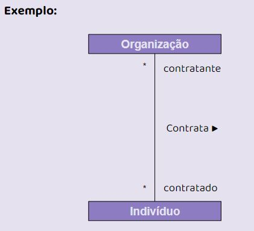

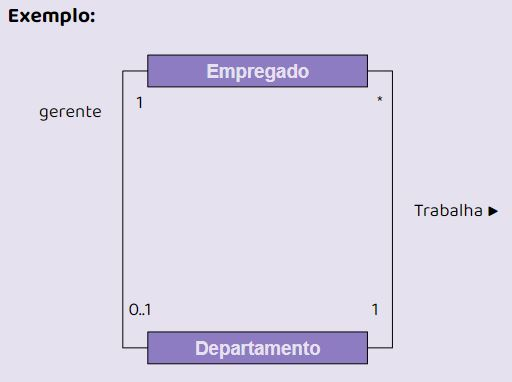

### Relacioanemtos - Agregação

Agregação é um tipo especial de associação, representa relação todo-parte.

Diferença é semântica! Na agregação um objeto está contido dentro do outro.

- Assimétrico. Se um objeto A é parte do objeto B, B não pode ser parte de A.

- Agregações propagam comportamento.

Sejam duas classes X e Y. Podemos verificar se X agrega Y respondendo as seguintes perguntas:

- X tem um ou mais Y?

- Y é parte de X?

No diagrama de classes, representamos agregações como uma linha com um diamante (losango) branco perto da classe do todo.

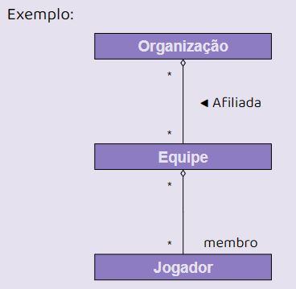

###  Relacioanemtos - Classes associativas 

Classes associativas são classes relacionados com associações, ao invés de outras classes.

São utilizadas quando precisamos manter informações que são da associação e não das classes associadas.

Na UML, classes associativas são representadas da mesma forma que classes normais. 

No entanto, a classe associativa estará ligada por uma linha tracejada à uma associação. Neste caso, o nome da classe substitui o nome da associação na linha.

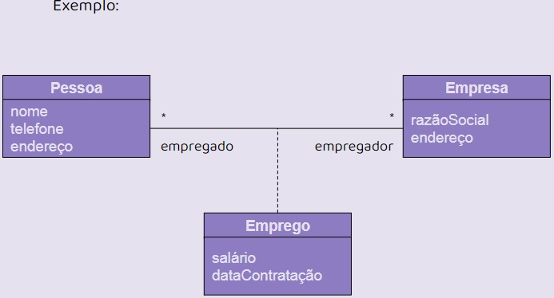

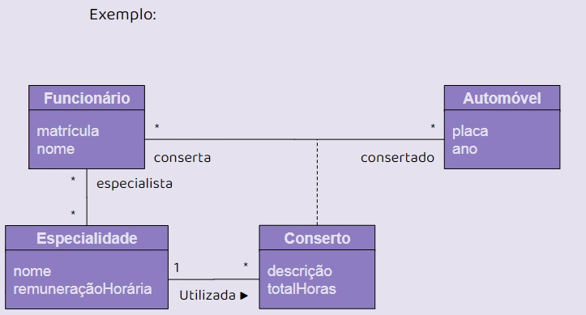

###  Relacioanemtos - Associações Ternárias 

Associações Ternárias são usadas quando precisamos associar objetos de três classes diferentes.

É possível ter associações ternárias e classes associativas em conjunto.

### Relacioanemtos - Associações Reflexivas

Associações Reflexivas ou auto-associações relaciona objetos de uma mesma classe. Onde objetos de uma classe possuem papéis distintos.
Uso de papéis é importante para evitar ambiguidade.

## Interpretadas

### Identificando Classes Iniciais

Identificar classes candidatas e remover classes desnecessárias. Processo não sequencial.

Identificar classes a partir de seus comportamentos relevantes para o sistema. De forma a cumprir suas responsabilidades.

Responsabilidades são tudo que um objeto conhece ou faz (só ou com ajuda).

- Objeto Cliente conhece seu nome, endereço e telefone.

- Objeto Pedido conhece sua data de realização e deve ser capaz de calcular seu valor total.

Existem casos onde a responsabilidade não pode ser cumprida pelo objeto sozinho. Nesses casos, o objeto requisita colaborações.

- Fatura de um pedido é solicitada.

- Objeto Pedido tem responsabilidade de fornecer seu valor total.

- Objeto Cliente tem responsabilidade de fornecer seu nome.

- Objeto ItemPedido fornece quantidade do produto e subtotal.

- Objetos Produto fornecem nome e valor unitário.

Colaborações são nossos Relacionamentos.

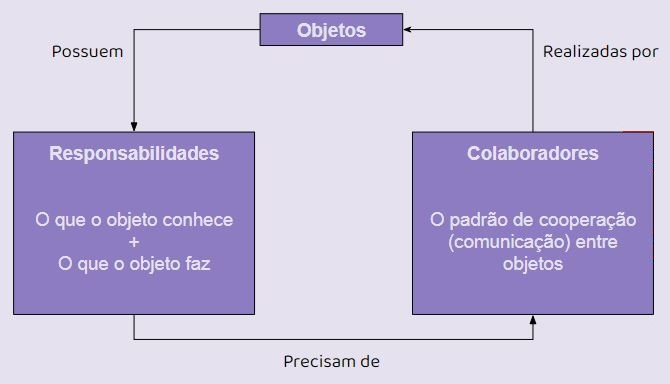