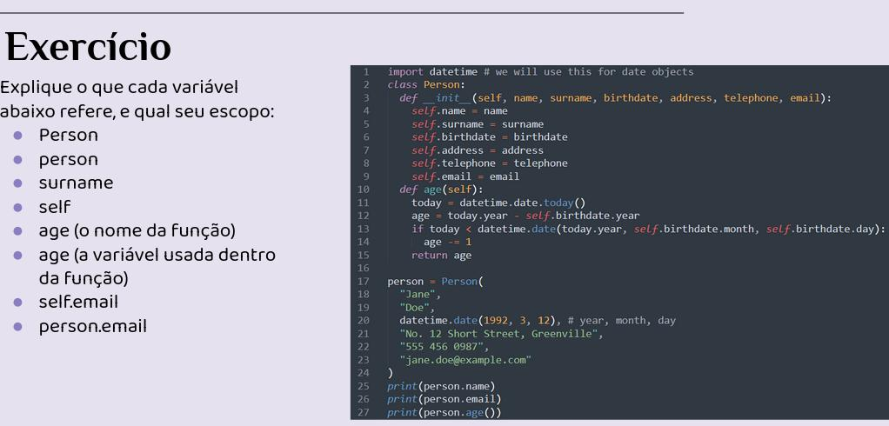

# OO em Python

## Classes

Python é uma linguagem com foco na **reusabilidade** de código e projetada para ser orientada à objetos.

- Podemos agrupar dados com os tipos built-ins do python (lista, tupla, dicionário, etc.);

- Podemos definir conjuntos de comandos facilmente reutilizados por meio de funções;

- **Classes** permitem agrupar dados e funções relacionadas de maneira legível.

- Às vezes, OO permite mapear facilmente objetos à coisas do mundo real;

- Nem sempre é necessário, desejável, ou possível codificar analogias perfeitas;

- Muitas vezes criaremos classes sem contrapartes no mundo real, simplesmente pela utilidade de agrupar métodos/atributos


Em python, todo tipo de dado é uma instância de uma classe, incluindo o próprio tipo (type);

Atributos:

Os valores de dados guardados dentro de um objeto são chamados de atributos;

Métodos:

As funções associadas à classe são chamadas métodos.


```python
import datetime # we will use this for date objects
class Person:
    def __init__(self, name, surname, birthdate, address, telephone, email):
        self.name = name
        self.surname = surname
        self.birthdate = birthdate
        self.address = address
        self.telephone = telephone
        self.email = email
    def age(self):
        today = datetime.date.today()
        age = today.year - self.birthdate.year
        if today < datetime.date(today.year, self.birthdate.month, self.birthdate.day):
            age -= 1
        return age

        
person = Person(
    "Jane",
    "Doe",
    datetime.date(1992, 3, 12), # year, month, day
    "No. 12 Short Street, Greenville",
    "555 456 0987",
    "jane.doe@example.com"
)

print(person.name)
print(person.email)
print(person.age())

```

class Person:

- Nós começamos a definição de uma classe com a palavra reservada class, seguida do nome da classe e dois-pontos. 

- Todas as heranças da classe são listadas entre parênteses, entre o nome da classe e os dois-pontos. Por enquanto vamos ignorar essa parte.

De maneira generalizada, classes são definidas como:

```python
class className([superclasses]):
```

- Dentro do corpo da classe podemos definir atributos e métodos.

- Atributos podem ser definidos no escopo da classe, mas comumente são definidos dentro do método construtor.

- No nosso exemplo temos dois métodos, o inicializador (__init__) e um método para calcular a idade (age):
def __init__(self, name, surname, birthdate, address, telephone, email):
def age(self):
    
```python
def __init__(self, name, surname, birthdate, address, telephone, email):
def age(self):
```

- Quando a classe é chamada, um novo objeto dessa classe é gerada e o método __init__ é automaticamente invocado. Esse método irá inicializar as variáveis do objeto com os parâmetros passados.

- O segundo método é uma função personalizada que calcula a idade de uma pessoa dada sua data de nascimento e a data atual.

```python
def __init__(self, name, surname, birthdate, address, telephone, email):
def age(self):
```

- Note que self é definido como parâmetro para ambos os métodos. Mas não é passado como parâmetro quando os métodos são chamados.

- Quando chamamos um método em um objeto, o próprio objeto é passado como parâmetro, permitindo acessar o objeto dentro do escopo dos métodos.

```python
def __init__(self, name, surname, birthdate, address, telephone, email):
    self.name = name
    self.surname = surname
    self.birthdate = birthdate
    self.address = address
    self.telephone = telephone
    self.email = email
```

- O método __init__ cria atributos em self, que é o próprio objeto.

- Os nomes utilizados no exemplo são os mesmos entre os parâmetros de __init__ e os atributos criados em self, mas não é obrigatório que sejam

```python
def age(self):
        today = datetime.date.today()
        age = today.year - self.birthdate.year
        if today < datetime.date(today.year, self.birthdate.month, self.birthdate.day):
            age -= 1
        return age
```

- O método age não recebe nenhum parâmetro, apenas self

- Note que self.birthdate é por si só um objeto da classe date, onde existem métodos e atributos (day, month, year).

- Definir uma classe, assim como definir uma função, não faz nada executar.

- Apenas é informado ao Python que a classe existe.



## Atributos de Instância

Os atributos definidos no __init__ não representam a totalidade dos atributos possíveis em um objeto. 

- É possível criar novos atributos diretamente na instância da classe, ou dentro de métodos da classe.
    
    - person.pets = [‘cat’, ‘dog’]

** Má prática de programação e quebra a orientação à objetos **

- Como __init__ executa antes de qualquer coisa, definir todos os atributos dentro dele (mesmo que vazios) garante que eles existiram ao tentar acessar.

- Criar fora pode acarretar em um atributo tentar ser acessado quando ele não existe.

Os métodos built in **getattr**, **setattr** e **hasattr**, nos permitem retornar o valor de um atributo, definir um atributo ou verificar se um objeto possui um atributo sem o uso do . utilizando o nome do atributo como string.

## Atributos de Classe

Tal como podemos definir atributos dentro do __init__ que serão inicializados quando um objeto for criado, também podemos definir atributos da própria classe, já inicializados

```python
class Person:
    TITLES = ('Dr', 'Mr', 'Mrs', 'Ms')
```

- Esses são acessados da mesma forma: person.TITLES

- Todos os objetos da classe terão atributos de classe com o mesmo valor após a criação.

- Atributos de classe podem também ser acessados pela classe, sem necessidade de instanciamento!
    -   Person.TITLES


- Atributos de classe são comumente utilizados para definir constantes da classe.

- É importante ter cuidado! 
    -   Caso o atributo de classe seja de um tipo mutável, todos os objetos da classe serão afetados: person.TITLES.append('Sr')

Mostrar **lp-exemplo-atributo-de-classe-problema.py**

EXEMPLO:

Explique as diferenças entre os atributos **name**, **surname** e **profession**, e quais valores eles podem ter em diferentes instâncias desta classe:


```python
class Smith:
    surname = "Smith"
    profession = "smith"

    def __init__(self, name, profession=None):
        self.name = name
        if profession is not None:
            self.profession = profession

```
**antes de __init__**

surname - atributo de classe

profession - atributo de classe


**em __init__ **

name - parâmetro

profession - parâmetro


**depois de __init__**

self.name - atributo

name - atributo

profession - atributo de classe

self.profession - atributo

profession - parâmetro

## OBS: __new__

em python:

__init__ é o inicializador

__new__ é o construtor (dentro do new tem o __init__)(mas ele não é muito utilizado)
