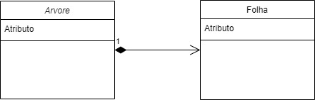

# Herança

## Composição

Composição é uma maneira de **agregar** objetos, tornando objetos atributos de outros.


Dadas duas classes Pessoa e Data:

- Pessoa tem um atributo dataDeAniverario, objeto da classe Data;

- Se descrevemos uma relação com tem um (**has-a**), há composição 

Composição pode ocorrer em relações:

- um-para-um;

- um-para-muitos;

- muitos-para-muitos.

E podem ser **unidirecionais** ou **bidirecionais**, dependendo das especificidades dos papéis.

Diferente da **agregação**, composição aponta em uma ligação forte entre objetos.

Se o objeto **possuidor** deixa de existir, o objeto **possuído** também deixa de existir.



## Herança

**Herança** é uma maneira de organizar classe de forma hierárquica, do mais generalizado ao mais específico.

Um objeto A que herda de um objeto B é considerado um **subtipo** de B. Nós chamamos a classe do objeto A de subclasse de B, e B é uma superclasse de A.

Em Python, todo objeto herda de object.

**Herança** vai nos permitir definir classe que possuem diferenças, mas também semelhanças em como funcionam.

Nós podemos definir todas as funcionalidades compartilhadas na **classe base** e então criar múltiplas subclasses para definir as peculiaridades.

**Permite maior reusabilidade de código**

OBS: 
(
*args  - Qualquer outro argumento que você passar

**kwargs - Qualquer outro argumento que você quer passar que tem chave valor

é uma prática comum passar já *args e **kwargs por argumentos em funções super
)


Notar nas classes **Pessoa**, **Estudante**, **Funcionario**, e **Professor**.

Notar as definições dos ```__init__``` e no uso de **super**

**As subclasses não precisam saber dos detalhes das superclasses.**

## Herana Múltipla

Algumas linguagens permitem que uma classe herda de múltiplas outras, chamamos isso de **Herança Múltipla**.

Nosso exemplo anterior pode parecer correto, mas ao expandirmos o sistema começamos a notar problemas. Em uma universidade real, a linha entre aluno e funcionário não é sempre tão clara.

- Alunos de pós-graduação fazem estágio docência, se tornando um tipo de funcionário temporário.

- Funcionários podem cursar disciplinas.

A herança múltipla é simples com exemplos básicos, mas algumas situações podem ser complicadas.

Diferentes linguagens resolvem de maneira diferente.

Exemplo: (se tiver problemas de colisão) Em Python a primeira classe tem importancia maior. (Python vai dar prioridade a todas as subclasses ligadas a primeira classe só depois passa a dar prioridade a segunda classe). Em JAVA não é permitido fazer heranças multiplas.


Caso desejemos usar herança múltipla, é uma boa ideia projetar nossas classes para evitar essa ambiguidade.

Uma maneira é dividir as classes em funcionalidades únicas, essas classes não servem para existir por si só, mas sim para serem utilizadas com heranças múltiplas. (Mix in)

Exemplo: